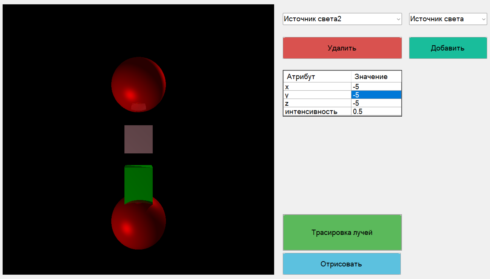

## Constructor3D
# Задание
Разработать программу моделирования блочного конструктора. Программа должна
обеспечить пользователю выбор фигур(куб, шар, параллелограм, наклонная усеченная пирамида),
изменение размеров и цветовых характеристик для объектов сцены. Характеристики отражения и
пропускания света задаются независимо для каждого из тел. Обеспечить возможность пользователю
вращать, передвигать, масштабировать элементы будущей модели, предусмотреть два точечных
источника света, которые находятся за пределаму сцены. Предусмотреть возможность врашать и
передвигать камеру.

